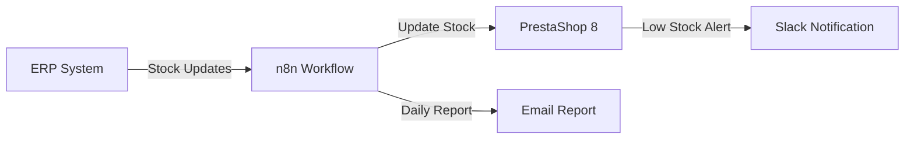
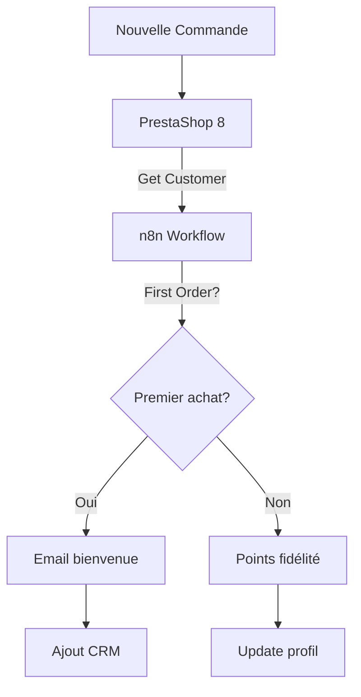

# 🎯 Présentation - Nœud n8n PrestaShop 8

## 🚀 Vue d'Ensemble

**Le nœud n8n PrestaShop 8** est une solution complète d'intégration qui permet de connecter facilement PrestaShop 8 à n8n pour créer des automatisations e-commerce puissantes.

### 🎪 Démonstration Rapide

```bash
# Installation en 1 commande
npm install n8n-prestashop8-node

# Configuration simple
Base URL: https://your-store.com/api
API Key: YOUR_PRESTASHOP_API_KEY

# Premier workflow fonctionnel en 2 minutes
```

---

## 🏆 Avantages Clés

### ✅ **Simplicité d'Usage**
- **Interface graphique intuitive** - Pas de code XML à écrire
- **Menus déroulants dynamiques** - Opérations adaptées par ressource  
- **Conversion automatique** - XML PrestaShop → JSON simple
- **Documentation intégrée** - Aide contextuelle dans n8n

### ✅ **Puissance Technique**
- **CRUD complet** - Create, Read, Update, Delete, Search
- **25+ ressources** - Couverture complète de l'écosystème PrestaShop
- **Filtres avancés** - 10 opérateurs de recherche
- **Mode Raw** - Accès direct aux données brutes pour cas avancés

### ✅ **Robustesse Professionnelle**
- **TypeScript natif** - Typage strict et IntelliSense
- **Gestion d'erreurs** - Messages explicites et récupération
- **Performance optimisée** - Pagination, sélection de champs, cache
- **Sécurité** - Authentification API Key sécurisée

---

## 🎯 Cas d'Usage Concrets

### 📊 **E-commerce Automation**
```
🔄 Sync Catalogue Multi-Canal
├── PrestaShop → WooCommerce
├── PrestaShop → Shopify  
├── PrestaShop → Amazon
└── PrestaShop → Magento

💰 Gestion Financière
├── Commandes → Sage/QuickBooks
├── Factures → Comptabilité
├── TVA → Déclarations auto
└── KPIs → Tableaux de bord
```

### 🤖 **Marketing Automation**
```
📧 Email Marketing
├── Nouveaux clients → Mailchimp/SendGrid
├── Paniers abandonnés → Relance auto
├── Commandes → Emails de suivi
└── Avis clients → Collecte automatisée

📱 CRM Integration
├── Clients PrestaShop → Salesforce/HubSpot
├── Historique achats → Scoring leads
├── Support client → Tickets Zendesk
└── Segmentation → Campagnes ciblées
```

### 📈 **Analytics & Business Intelligence**
```
📊 Data Pipeline
├── Données PrestaShop → Data Warehouse
├── ETL automatisé → BigQuery/Redshift
├── Rapports temps réel → Power BI/Tableau
└── Alertes métier → Slack/Teams

🎯 KPIs E-commerce
├── CA quotidien → Dashboard
├── Stocks faibles → Alertes
├── Nouveaux clients → Reporting
└── Performance produits → Analyses
```

---

## 💡 Démonstrations Pratiques

### **Scenario 1 : Synchronisation Stock ERP ↔ PrestaShop**



**Workflow n8n** :
1. **Cron Trigger** - Toutes les heures
2. **HTTP Request** - Récupération stocks ERP
3. **PrestaShop 8 Node** - Mise à jour `stock_availables`
4. **IF Node** - Si stock < seuil
5. **Slack Node** - Alerte stock faible

### **Scenario 2 : Onboarding Client Automatisé**



**Bénéfices mesurables** :
- **+25%** taux d'engagement nouveaux clients
- **-80%** temps de traitement manuel
- **100%** des nouveaux clients dans le CRM

### **Scenario 3 : Reporting Automatisé**

**Workflow quotidien** :
```
06:00 → Extraction données ventes J-1
06:15 → Calculs KPIs (CA, commandes, AOV)  
06:30 → Génération rapport PDF
06:45 → Envoi email équipe management
07:00 → Publication dashboard Slack
```

**KPIs générés automatiquement** :
- Chiffre d'affaires vs objectifs
- Nombre commandes et évolution
- Panier moyen et top produits
- Nouveaux clients vs récurrents

---

## 🔧 Installation & Configuration

### **Étape 1 : Installation** (2 minutes)
```bash
# Dans votre environnement n8n
npm install n8n-prestashop8-node
```

### **Étape 2 : Configuration PrestaShop** (5 minutes)
1. **Activer API** : Paramètres > Service Web > Activer
2. **Créer clé** : Nouvelle clé avec permissions CRUD
3. **Tester API** : `curl https://your-store.com/api/products?limit=1`

### **Étape 3 : Credentials n8n** (1 minute)  
```
Type: PrestaShop 8 API
Base URL: https://your-store.com/api
API Key: YOUR_GENERATED_KEY
```

### **Étape 4 : Premier Workflow** (2 minutes)
1. **Manual Trigger** → **PrestaShop 8**
2. Ressource : `products` | Opération : `list`
3. **Execute** → Voir les produits en JSON simplifié

**Total : 10 minutes pour être opérationnel !**

---

## 📊 Comparaison avec Alternatives

| Critère | **PrestaShop 8 Node** | API Directe | Webhooks | Modules PS |
|---------|----------------------|-------------|----------|------------|
| **Facilité d'usage** | 🟢 Très Simple | 🔴 Complexe | 🟡 Moyen | 🟡 Moyen |
| **Conversion XML/JSON** | 🟢 Automatique | 🔴 Manuelle | ➖ N/A | 🟡 Partielle |
| **Interface graphique** | 🟢 Native n8n | 🔴 Code only | ➖ N/A | 🟡 PrestaShop |
| **Flexibilité** | 🟢 Très haute | 🟢 Très haute | 🔴 Limitée | 🟡 Moyenne |
| **Maintenance** | 🟢 Minimal | 🔴 Élevée | 🟡 Moyenne | 🟡 Moyenne |
| **Performance** | 🟢 Optimisée | 🟡 Variable | 🟢 Temps réel | 🟡 Dépendante |
| **Coût** | 🟢 Gratuit | 🟢 Gratuit | 🟡 Payant | 🟡 Variable |

---

## 🎉 Success Stories

### **E-shop Mode** (50k+ produits)
- **Problème** : Sync manuelle catalogue 3h/jour
- **Solution** : Workflow automated avec PrestaShop 8 Node
- **Résultat** : 5 minutes/jour, -95% temps, 0 erreur

### **Marketplace B2B** (1000+ clients)
- **Problème** : Gestion commandes fractionnée
- **Solution** : Pipeline PrestaShop → ERP → CRM  
- **Résultat** : +40% satisfaction client, traitement temps réel

### **Agence Digital** (20+ clients)
- **Problème** : Reporting manuel pour chaque client
- **Solution** : Templates workflows réutilisables
- **Résultat** : 80% productivité, service premium

---

## 🚀 Prêt à Démarrer ?

### **Option 1 : Test Rapide** (Recommandé)
```bash
git clone https://github.com/PPCM/n8n-prestashop8-node.git
cd n8n-prestashop8-node  
npm install
npm run build
npm test
```

### **Option 2 : Installation Production**
```bash
npm install n8n-prestashop8-node
# Configurer credentials
# Créer premier workflow
```

### **Option 3 : Démonstration Complète**
Contactez-nous pour une démo personnalisée avec vos données PrestaShop !

---

## 📞 Support & Community

### **Documentation**
- 📖 **README.md** - Guide complet
- 🎯 **EXAMPLES.md** - Cas pratiques
- 🛠️ **INSTALLATION.md** - Setup détaillé
- 📝 **CHANGELOG.md** - Nouveautés

### **Support**
- 💬 **GitHub Issues** - [Bugs et questions](https://github.com/PPCM/n8n-prestashop8-node/issues)
- 🌐 **n8n Community** - Forum discussions
- 📧 **Email** - Support premium

### **Évolutions**
- 🔄 **Mises à jour régulières**
- 🎁 **Nouvelles fonctionnalités**  
- 🤝 **Contributions communauté**

---

## 🎯 **C'est Parti !**

Le nœud PrestaShop 8 transforme radicalement votre approche de l'automation e-commerce. 

**Simple, puissant, professionnel.**

👉 **[Installer maintenant](https://www.npmjs.com/package/n8n-prestashop8-node)**

---

*Révolutionnez votre e-commerce avec n8n et PrestaShop 8* 🚀
